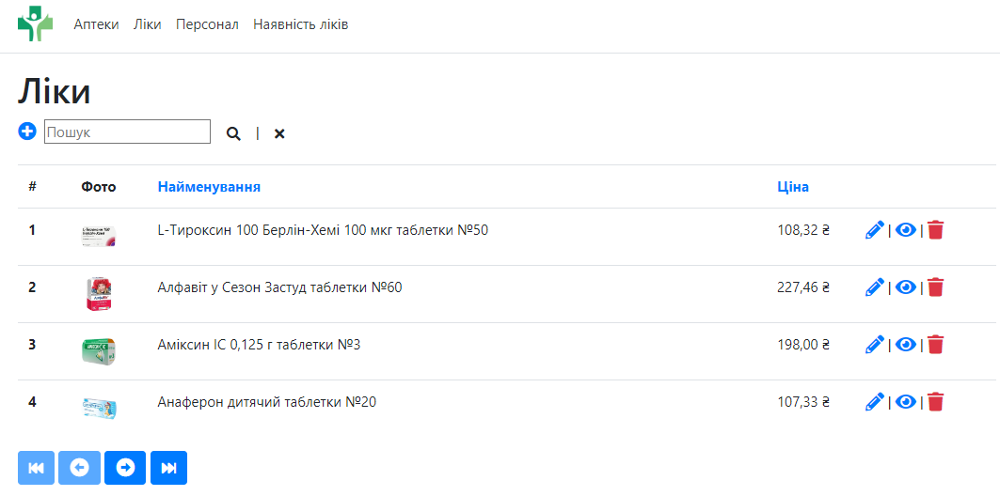

Pharmacy Management System 
========================
Features: 
---------------
- Manage pharmacies
- Manage medicines
- Manage staff
- Manage availability

Installation: 
---------------
Everything should work out of the box 
Все повинно працювати без додаткових налаштувань. 

Built With: 
--------------------
- ASP.NET Core 3.1
- Entity Framework Core
- Razor Pages
- SQL Server

Система управління аптеками: 
---------------------------------
- Управління аптеками
- Управління ліками
- Управління персоналом
- Управління наявністю ліків

  
  
  
  
  
  